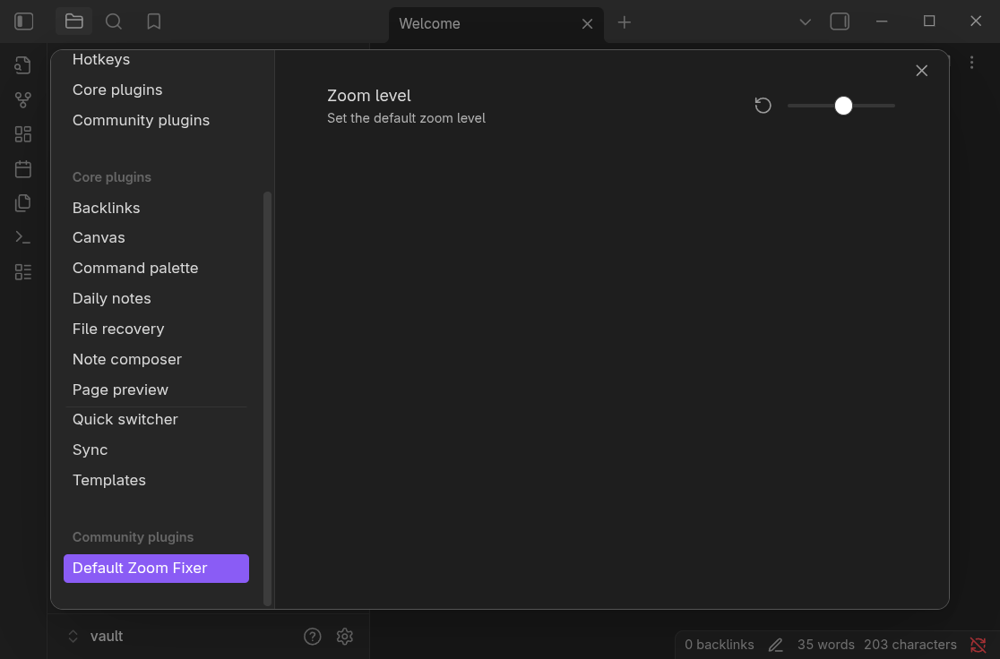

# Default Zoom Fixer for Obsidian

Fixes Obsidian's broken zoom‑level persistence on Linux (e.g. under XWayland or Wayland). Many users report that Obsidian's default zoom resets to 100% on restart, especially on Wayland/X11 setups. This plugin forces and remembers your preferred zoom level reliably.



## Building

This plugin uses TypeScript and Bun. You will need [Bun](https://bun.sh) installed in order to build it.

**Build:**

```sh
bun install
make build
```

**Install to vault:**

```sh
VAULT_PATH=/path/to/vault make install
```

Or manually:

1. `mkdir -p /path/to/vault/.obsidian/plugins/default-zoom-fixer`
2. `cp -r dist/* /path/to/vault/.obsidian/plugins/default-zoom-fixer/`

After installing the plugin files restart Obsidian, and enable the plugin in **Settings → Community plugins**
